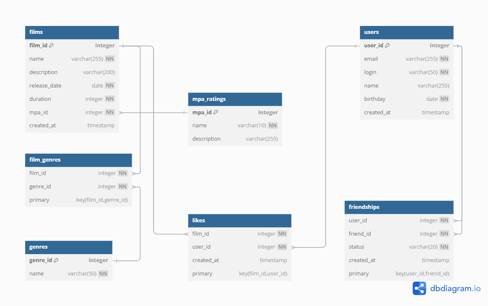

# java-filmorate
Template repository for Filmorate project.

# Схема базы данных

## Основные таблицы

### `users`
Хранит информацию о пользователях:
- `user_id` - уникальный идентификатор
- `email`, `login` - обязательные поля для авторизации
- `name` - имя (может быть пустым)
- `birthday` - дата рождения

### `films`
Содержит данные о фильмах:
- `film_id` - уникальный идентификатор
- `name` - название фильма
- `description` - краткое описание (до 200 символов)
- `release_date` - дата выхода
- `duration` - продолжительность в минутах
- `mpa_id` - возрастной рейтинг

## Справочники

### `mpa_ratings`
Возрастные рейтинги (G, PG, PG-13, R, NC-17)

### `genres`
Жанры фильмов (Комедия, Драма и др.)

## Связующие таблицы

### `film_genres`
Связывает фильмы с жанрами (многие-ко-многим)

### `likes`
Лайки пользователей (связь пользователей и фильмов)

### `friendships`
Дружеские связи между пользователями:
- `status` - подтверждённая/неподтверждённая дружба





## 📜 SQL Scripts  

### **Создание таблиц**  
```sql
CREATE TABLE mpa_ratings (
    mpa_id INTEGER PRIMARY KEY,
    name VARCHAR(10) NOT NULL
    description VARCHAR(255)
);

CREATE TABLE genres (
    genre_id INTEGER PRIMARY KEY,
    name VARCHAR(50) NOT NULL
);

CREATE TABLE films (
    film_id INTEGER PRIMARY KEY,
    name VARCHAR(255) NOT NULL,
    description VARCHAR(200),
    release_date DATE NOT NULL,
    duration INTEGER NOT NULL,
    mpa_id INTEGER NOT NULL,
    created_at TIMESTAMP DEFAULT CURRENT_TIMESTAMP,
    FOREIGN KEY (mpa_id) REFERENCES mpa_ratings (mpa_id)
);

CREATE TABLE film_genres (
    film_id INTEGER NOT NULL,
    genre_id INTEGER NOT NULL,
    PRIMARY KEY (film_id, genre_id),
    FOREIGN KEY (film_id) REFERENCES films (film_id) ON DELETE CASCADE,
    FOREIGN KEY (genre_id) REFERENCES genres (genre_id) ON DELETE CASCADE
);

CREATE TABLE users (
    user_id INTEGER PRIMARY KEY,
    email VARCHAR(255) NOT NULL,
    login VARCHAR(50) NOT NULL,
    name VARCHAR(255),
    birthday DATE NOT NULL,
    created_at TIMESTAMP DEFAULT CURRENT_TIMESTAMP
);

CREATE TABLE likes (
    film_id INTEGER NOT NULL,
    user_id INTEGER NOT NULL,
    created_at TIMESTAMP DEFAULT CURRENT_TIMESTAMP,
    PRIMARY KEY (film_id, user_id),
    FOREIGN KEY (film_id) REFERENCES films (film_id) ON DELETE CASCADE,
    FOREIGN KEY (user_id) REFERENCES users (user_id) ON DELETE CASCADE
);

CREATE TABLE friendships (
    user_id INTEGER NOT NULL,
    friend_id INTEGER NOT NULL,
    status VARCHAR(20) NOT NULL CHECK (status IN ('unconfirmed', 'confirmed')),
    created_at TIMESTAMP DEFAULT CURRENT_TIMESTAMP,
    PRIMARY KEY (user_id, friend_id),
    FOREIGN KEY (user_id) REFERENCES users (user_id) ON DELETE CASCADE,
    FOREIGN KEY (friend_id) REFERENCES users (user_id) ON DELETE CASCADE
);